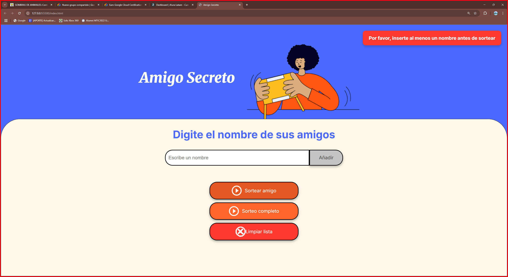
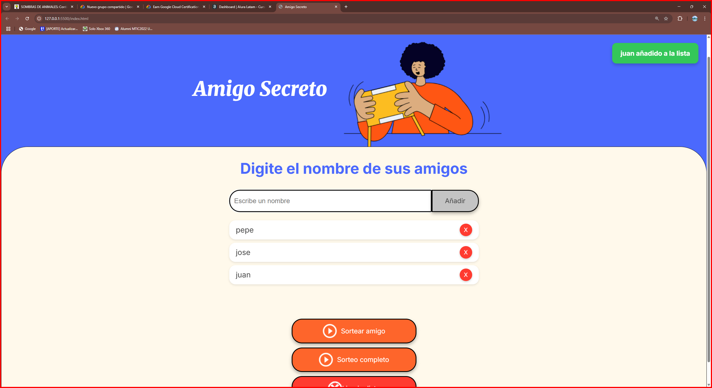
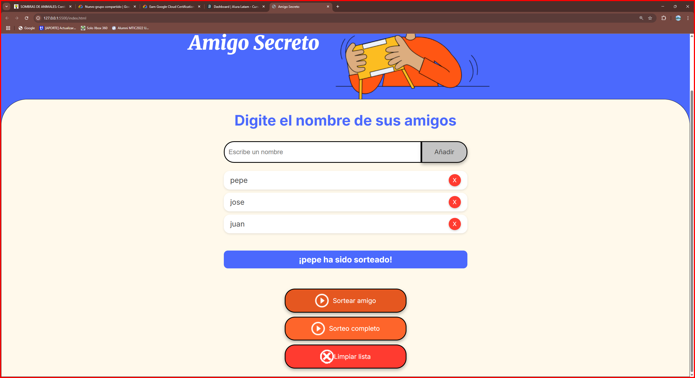
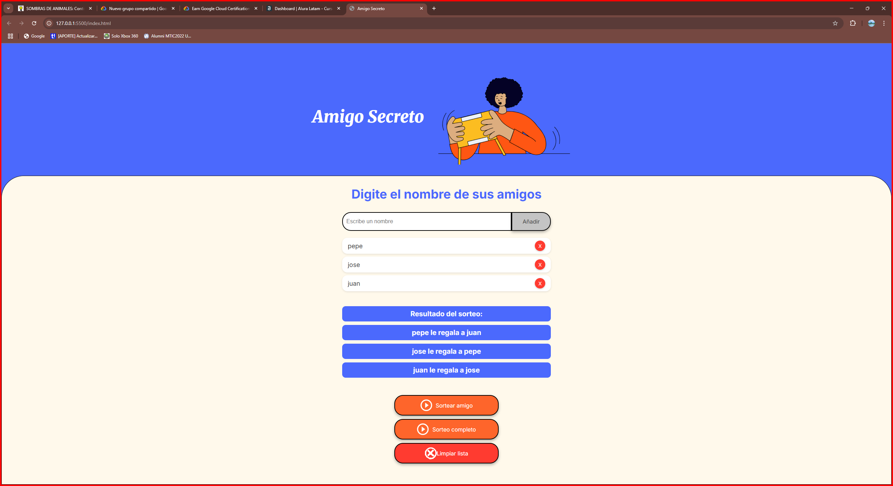
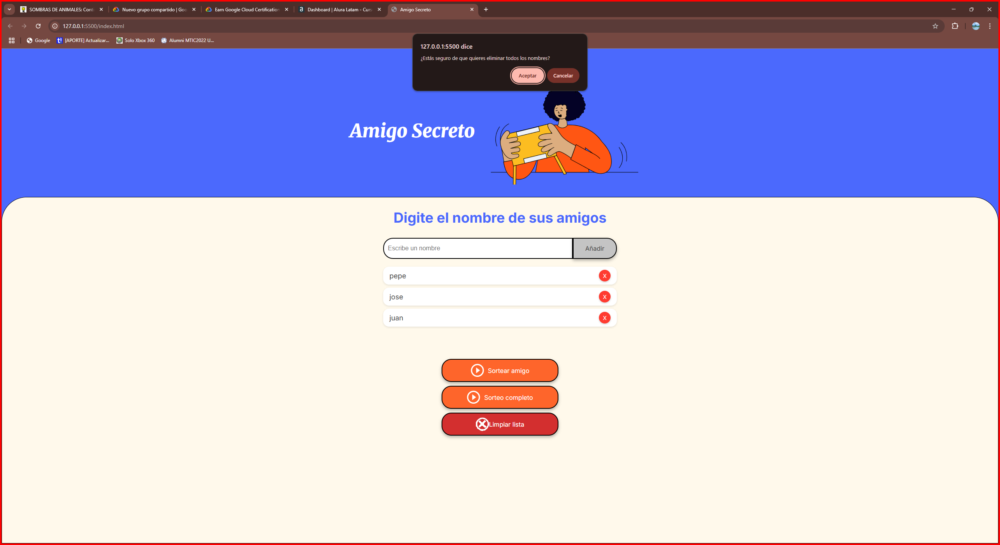

# Challenge Alura - Amigo Secreto

Este desafío consiste en una aplicación que permite a los usuarios ingresar nombres de amigos en una lista, realizar un sorteo aleatorio y determinar quién es el **"Amigo Secreto"**. Los usuarios pueden agregar nombres a través de un campo de texto y un botón **"Añadir"**, visualizar la lista y, finalmente, hacer clic en **"Sortear Amigo"** para seleccionar un nombre aleatorio, mostrando el resultado en pantalla. **"Evitar duplicados"** Verificar que no se agregue el mismo nombre dos veces, **"Opción para eliminar amigos"** Añadir un botón de eliminar junto a cada nombre, **"💾Persistencia de datos"** Guardar la lista de amigos en localStorage para mantenerlos si se cierra el navegador.

## Funcionalidades ⚙️

- ✍️**Agregar nombres:** Los usuarios pueden ingresar nombres en un campo de texto y hacer clic en **"Añadir"** para agregarlos a la lista.

   

-❗✅**Validación de entrada:** Si el campo de texto está vacío o contiene caracteres no válidos, el sistema mostrará una alerta solicitando un nombre válido.

   

- 👀**Visualización dinámica:** Los nombres ingresados aparecerán en una lista actualizada automáticamente debajo del campo de entrada.

   

- 🎲**Sorteo aleatorio:** Al hacer clic en el botón **"Sortear Amigo"**, el sistema seleccionará aleatoriamente un nombre de la lista y lo mostrará en pantalla.

   

 - 🖥️**Sorteo completo:** En lugar de solo seleccionar un amigo aleatorio, emparejar a cada persona con otra (verdadero amigo secreto).
   

   **Funcion de eliminar todos los nombre** elimina los nombres despues de terminar el juego'
   

## Comenzando 🚀

Sigue estos pasos para obtener una copia del proyecto y empezar a trabajar localmente.

### Pre-requisitos 📋

No necesitas herramientas adicionales para ejecutar este proyecto. Solo asegúrate de tener un navegador web como Firefox, Chrome, o sus variaciones. Si trabajas con Visual Studio Code, puedes utilizar la extensión [Live Server](https://marketplace.visualstudio.com/items?itemName=ritwickdey.LiveServer) para una experiencia más fluida.

### Instalación 🔧

1. Clona el repositorio en tu máquina local:
    ```bash
    git clone https://github.com/Sodi0/challenge-amigo-secreto_esp-main.git
    ```

2. Navega al directorio del proyecto:
    ```bash
    cd challenge-amigo-secreto_esp-main
    ```

3. Abre el archivo `index.html` en tu navegador favorito para empezar a usar la aplicación.

### Ejecución local 🔥

Este proyecto no requiere ninguna instalación adicional. Simplemente abre el archivo `index.html` en tu navegador y empieza a usar la aplicación.

## Construido con 🛠️

- [HTML](https://developer.mozilla.org/en-US/docs/Web/HTML) - Para la estructura y diseño de la página.
- [CSS](https://developer.mozilla.org/en-US/docs/Web/CSS) - Para los estilos visuales.
- [JavaScript](https://developer.mozilla.org/en-US/docs/Web/JavaScript) - Para la lógica de la aplicación (agregar nombres, realizar el sorteo, etc.).
# Descripción del Proyecto: Amigo Secreto

Este proyecto es una aplicación web interactiva para organizar un intercambio de regalos tipo "Amigo Secreto" (también conocido como "Secret Santa"). La aplicación permite a los usuarios crear una lista de participantes y realizar sorteos aleatorios para asignar quién le regalará a quién.

## Características principales

- **Gestión de participantes**: Los usuarios pueden añadir, visualizar y eliminar nombres de participantes de manera sencilla e intuitiva.

- **Múltiples opciones de sorteo**: La aplicación ofrece dos tipos de sorteo:
  - Sorteo simple: Selecciona un solo participante al azar de la lista.
  - Sorteo completo: Crea una asignación aleatoria donde cada participante regala a otro participante, asegurando que nadie se regale a sí mismo.

- **Interfaz amigable**: Diseño responsive con animaciones y notificaciones visuales para una mejor experiencia de usuario.

- **Persistencia de datos**: La lista de participantes se guarda en el almacenamiento local del navegador, manteniéndose disponible incluso después de cerrar y volver a abrir la aplicación.

- **Validaciones**: Evita la entrada de nombres duplicados o vacíos, proporcionando retroalimentación clara al usuario.

## Tecnologías utilizadas

- 📄 HTML5 para la estructura
- 🎨 CSS3 para el diseño y animaciones
- ⚙️ JavaScript para la lógica y funcionalidad
- 🌐 LocalStorage para la persistencia de datos

Esta aplicación es ideal para organizar eventos sociales, intercambios de regalos en oficinas, familias o grupos de amigos, simplificando el proceso de asignación de "amigos secretos" de forma divertida y transparente.